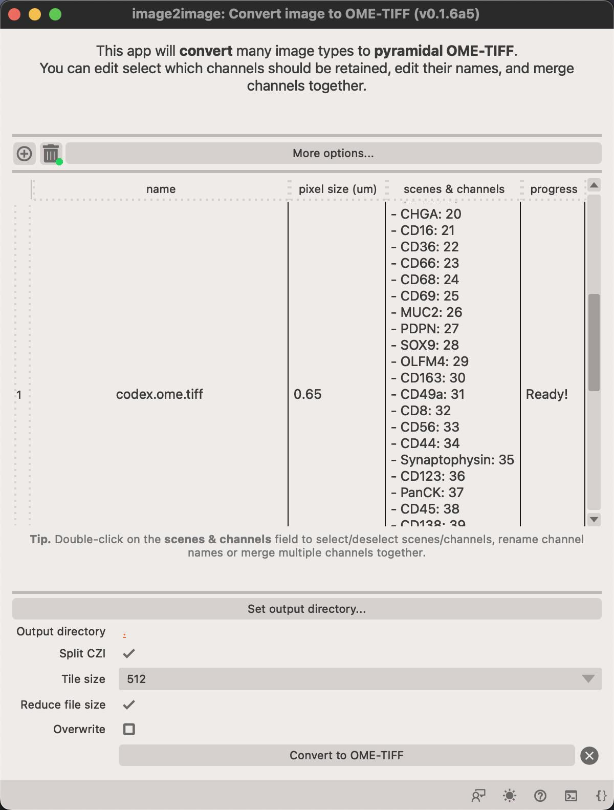
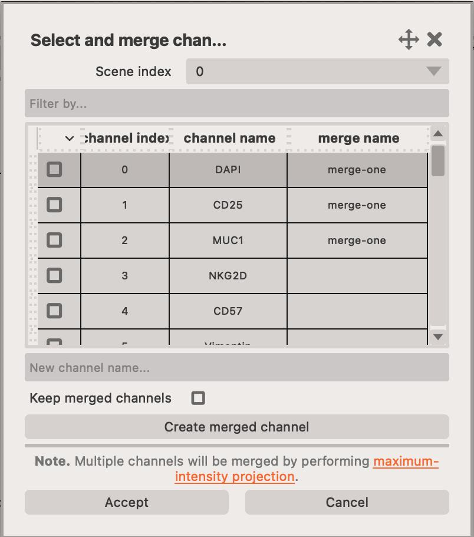
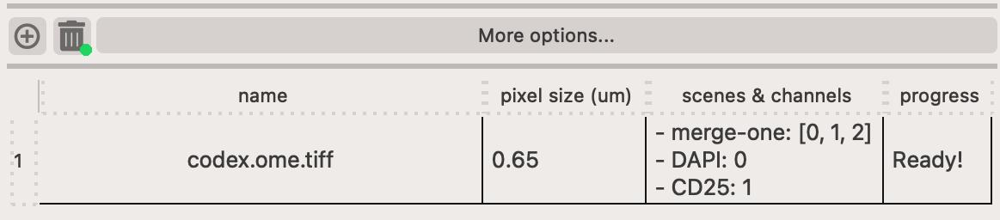

# Convert app

This app let's you convert multiple image formats to OME-TIFF.

<figure markdown>
  { width=600px; }
</figure>

You can adjust which channels should be included in the final image by double ++left-button++ clicking on the channel name. 

This opens a new dialog where you can change selct or de-select channels, change their names and merge multiple channels into one.

<figure markdown>
  { width=500px; }
</figure>

You can also `merge` multiple channels within an image to form a single channel. Multiple channels are projected into a single channel by using maximum intensity projection.

Click on the `Merge...` button to open the popup window.

<figure markdown>
  { width=500px; }
</figure>

Here, you can select several channels and merge them into a single channel. You must specify the `New channel name...` and click on the `Create merged channel` button. 

You can optionally retain the `merged channels` in the final image by checking the `Keep merged channels` checkbox.

!!! note "Click on `Accept` to save selection"
    Click on `Accept` to save the selection and close the dialog.

Once you've selected which channels should be retained and merged, they should appear like this in the table.

<figure markdown>
  { width=500px; }
</figure>