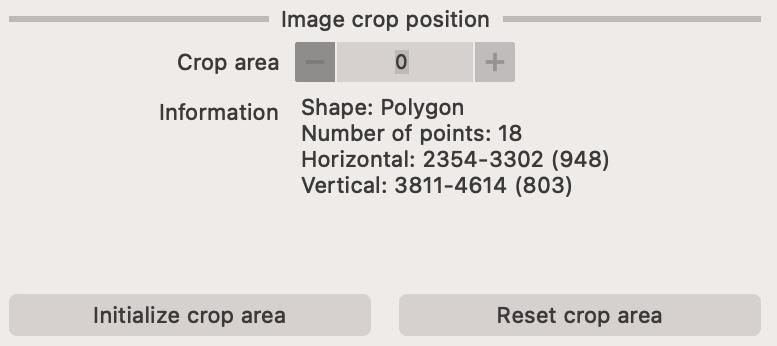

# Crop app

This app can be used for cropping (or masking) parts of an image in order to reduce the image size, improve the image registration or to remove unwanted parts of the image.

<figure markdown>
  { width=600px; }
<figcaption>Cropping of an image using the Crop app.</figcaption>
</figure>

## Steps to crop an image

1. Load image(s) by clicking on the :fontawesome-solid-circle-plus: button. This will let you select images to load. You can alternatively drag-and-drop images into the canvas.
2. Select the `Mask` layer in the viewer controls at the bottom right-hand side.
3. Select the tool you wish to use. You can choose from `circle`, `rectangle`, `polygon` or `freehand` tools. 
4. Draw the mask on the image. You can adjust the mask by clicking on the `Mask` layer in the viewer controls and then clicking on the `edit` button. This will allow you to move the mask, change it's shape or delete it.

<figure markdown>
  { width=600px; }
<figcaption>Cropping of an image using the Crop app.</figcaption>
</figure>

!!! note "Multiple masks are allowed"
    You can draw multiple masks on the image. This is useful if you want to crop multiple regions of same image.

!!! note "Multiple images are allowed"
    You can load multiple images (e.g. if they are co-registered together) and crop all of them at once. This will ensure that the cropped regions are the same in all images.

## Previewing the cropped image

You can preview the cropped image by clicking on the `Preview (crop)` button. This will create a new image with the cropped region. 

<figure markdown>
  { width=600px; }
<figcaption>Cropping of an image using the Crop app.</figcaption>
</figure>

When cropping images, different shapes behave slightly differently.

- the `rectangle` shape will crop the image to the rectangle that you've drawn.
- the `circle`, `polygon` and `freehand` shapes will crop the bounding box of the polygon that you've drawn, however, any region outside of the drawn region will be masked.

## Information about the mask

You can see basic information about each `mask` in the `Image crop position` section of the panel.

<figure markdown>
  { width=600px; }
<figcaption>Cropping of an image using the Crop app.</figcaption>
</figure>