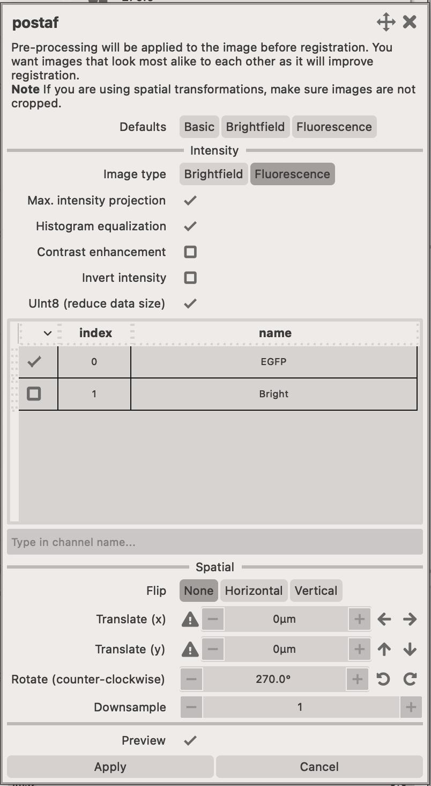
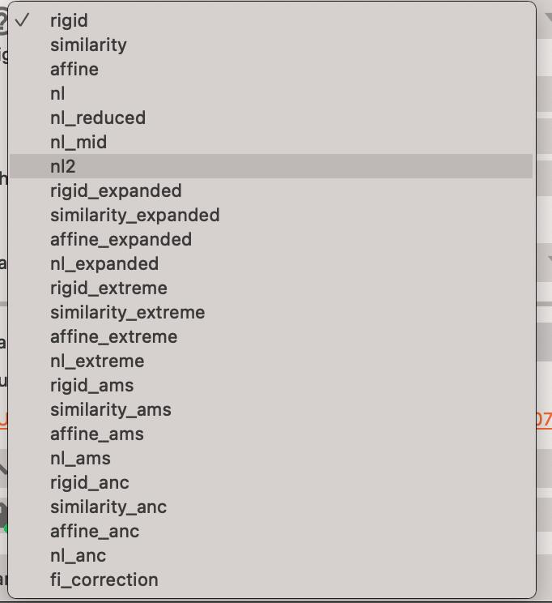
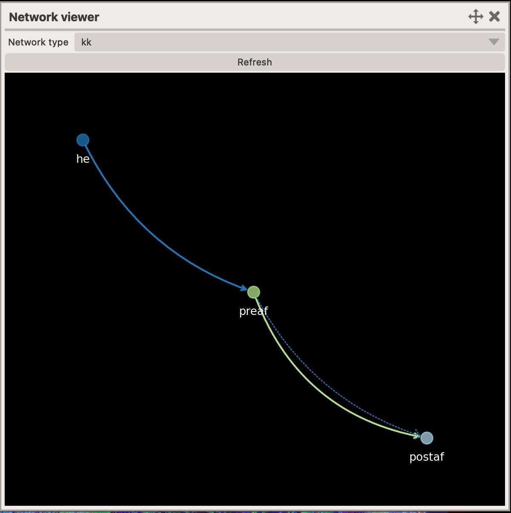

# Elastix app

This app performs whole-slide image registration, similar to what [napari-wsireg](https://github.com/NHPatterson/napari-wsireg) does. The main difference is that it has improved image pre-processing (which in turn improves the registration), easier creation of masks and cropping areas, utilizes a `project` structure and has much improved command-line interface.

<figure markdown>
  { width=600px; }
</figure>

## Simplified workflow (see below for more information)

1. Load the images you wish to co-register.
2. Adjust their names, parameters.
3. Establish the registration paths.
4. Adjust the export options.
5. Execute the registration.

## Live preview

You can immediately preview how your images will look like after before registration. This is extremely useful since it's important that images used for registration highlight their features. 

<figure markdown>
  { width=600px; }
</figure>

To enable this, make sure to click on the `Use preview image` checkbox.

## Pre-processing

In the top-right corner of the app, you can find the list of image modalities that will be registered. You can adjust the pre-processing parameters for each modality by clicking on the `widget` or on the `Pre-process...` button.

The widget also allows you to adjust the `name` of the modality, spatial resolution (if it was read incorrectly from the file metadata) and the `color` of the image.

There are a number of pre-processing parameters that can be adjusted to improve the registration process. They can be roughtly divided into two categories:

- Intensity - adjusts how the intensity of the image is transformed.
    - Multi-channel images must be turned into a single-channel image, usually done by using `maximum intensity projection`.
    - You can improve the contrast of the image channels by using `histogram equalization` or `contrast enhancement` (or both).
    - if your image is `light or dark background` (e.g. H&E) then you must `invert` the intensities
- Spatial - adjusts the spatial information of the image
    - You can `flip`, `rotate` or `translate` images. This can be useful to give the image a better starting point for registration.
    - You can `downsample` the image to speed-up the registration process.

<figure markdown>
  { width=400px; }
</figure>

## Masking

You can create masks to focus the registration on a specific part of the image. You can start this process by clicking on the `Mask...` button which opens a new dialog window.

<figure markdown>
  { width=400px; }
</figure>

There you can create a mask for each modality that is being registered.

!!! success "Click on `Add mask`"
    It's important that you click on the `Add mask` button to create a new mask. If you don't do this, the mask might not be saved and you will have to start over.

## Registration paths

Just like in `wsireg`, we are using registration paths to define which images should be registered together.

There is always a `source` modality which is going to be `moved` to the `target` modality. You can also define a `through` modality, which is a modality that the `source` is going to be registered to first, and then the `target` is going to be registered to the `through` modality.

There are many options available ranging from `rigid`, `affine` to `non-linear` options.
<figure markdown>
  { width=400px; }
</figure>

You can visualise the registration path by opening the `registration network` widget.

<figure markdown>
  { width=400px; }
</figure>

## Export options

There are several export options available to you. This includes which images (or attachment modalities) should be transformed and exported.

<figure markdown>
  { width=400px; }
</figure>

## Execution

Registration can be executed directly in the app or via the command-line interface. The command-line interface is more powerful, as it permits batch processing, however, the in-app execution is more user-friendly.

<figure markdown>
  { width=400px; }
</figure>

Tasks that are being registered in the app, go the `Tasks queue` widget. You can access it from the statusbar at the bottom of the app.

<figure markdown>
  { width=400px; }
</figure>

## Project structure

Elastix projects are saved into a `<your project name>.wsireg` folders that contain several sub-folders that should maintaiance and keeping track of your registration process.

The folder normally contains the following sub-folders:

- Cache - contains the pre-processed images and masks. You should check this folder when registration fails and see whether the pre-processed images look anything alike.
- Images - contains the registered images. This folder will contain any `registered` data including images, GeoJSONs, point data, etc.
- Logs - contains the logs of the registration process. This can be useful to check what `commands` were executed on the project.
- Progress - contains the progress of the registration process. This folder contains miscellaneous files that are used to keep track of the registration process.
- Transformations - contains the transformation matrices. This folder contains the `elastix` transformation data that can be used to transform the microscopy images (and any associated data) to the new coordinate system.
