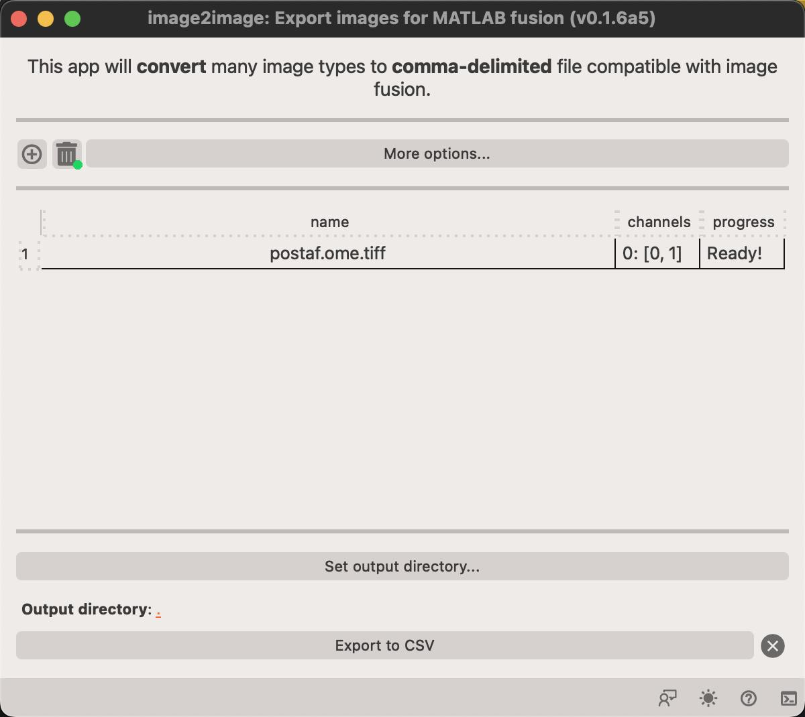

# Fusion Preparation App

This app enables export of microscopy data in CSV file format that is compatible with Raf Van de Plas' fusion program. The fusion tool uses a non-standard CSV format which can be troublesome to generate using normal tools.

## Steps to export image(s)

1. Load your image(s) by drag-and-drop into the window or clicking on the :fontawesome-solid-circle-plus:   button. This let's you select images to load.
2. Select the output directory by clicking on the `Set output directory` button.
3. Click on the `Export to CSV` button to initiate the output. Progress of the exprt is shown in the `progress` column.

<figure markdown>
  { width=500px; }
</figure>

!!! warning Warning
        This app does not have viewer canvas so the images will not be displayed!
