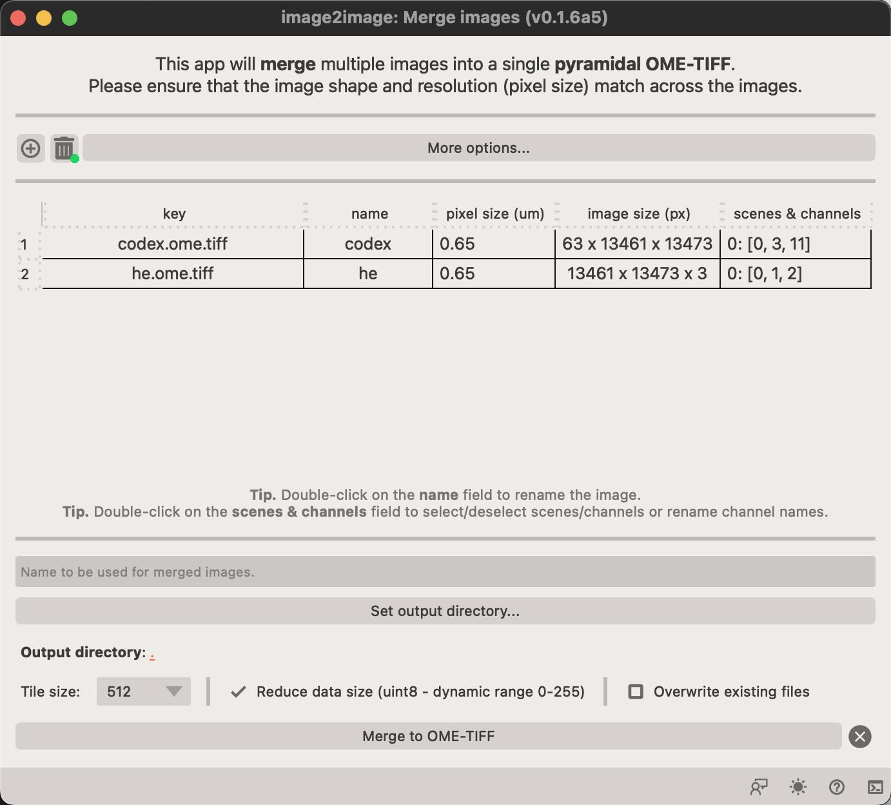

# Merge app

This app let's you merge several files into one.

<figure markdown>
  { width=500px; }
</figure>

You can adjust which channels should be included in the final dataset by double ++left-button++ clicking on the channel name. The channels will be merged in the order they are listed in the dialog.

This opens a new dialog where you change `channel names` and also select or un-select channels.

<figure markdown>
  { width=500px; }
</figure>

!!! note "Click on `Accept` to save selection"
    Click on `Accept` to save the selection and close the dialog.