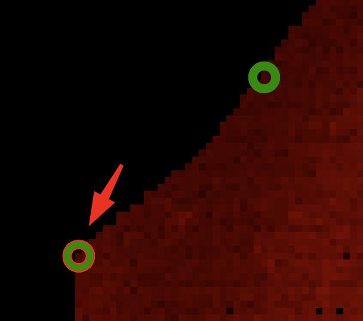
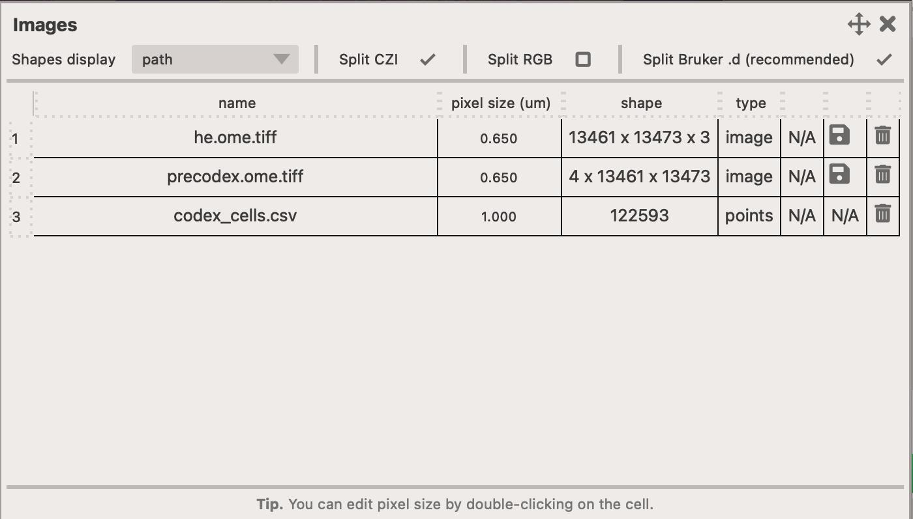

# Registration App

This is a simple image registration tool that can be used instead of napari-imsmicrolink.

You should use the napari-wsireg app for automatically registering your microscopy images together, but you can use
image2registration to co-register your IMS data with the postIMS-AF.

This app defines the `Fixed` and `Moving` modalities. As the names suggest, the `Fixed` modality should normally represent the microscopy modality to which you want to co-register your IMS data. Consequently, the `Moving` modality is the IMS dataset.

<figure markdown>
  { width=600px; }
</figure>

## Obtaining transformation matrix

1. Select your `Fixed` image by clicking on the :fontawesome-solid-circle-plus: button. This will let you select images to load. You can alternatively drag-and-drop images into the canvas.
2. Select the channels you want to immediately display. All channels will be loaded but not all displayed if you've unselected some.
3. Repeat this for the `Moving` modality.
4. Click on the :fontawesome-solid-circle-plus: icon in the toolbar on the left-hand side (or click ++2++ on your keyboard to activate the `add` mode).
5. Select at least **4** points in each image to estimate transformation matrix. After that, you can click in either image and the other will be predicted.
6. Once you are happy with your results. Save them as the `i2r.json` format which can be used in the [viewer](viewer.md) app or to transform images and masks.

You can overlay any of the  `moving` images on the `fixed` image by selecting an image in the `Overlay` combobox. You can also toggle the view type between `Random` image (where we fill-in the image with random values) or `Overlay` which directly represents the co-registered image.

<figure markdown>
  { width=600px; }
</figure>

!!! note "Prediction"
    The registration app only requires **4** points to estimate transformation matrix. Once four points have been added to **both** views, it will start to `predict` where points **might** be. For instance, if you add a new point in the `Fixed` viewer, it will automatically place a point in the `Moving` viewer. You can then take a look if you are happy with the position and move it to where it **should** be. The more points you have, the better the predicted transformation will be.

!!! note "Compatibility with `napari-imsmicrolink`"
    If you have previous `napari-imsmicrolink` registrations, you can load them into `image2register` by clicking on the `Import project` button. The output of the `napari-imsmicrolink` plugin contains information about what images were used, the pixel size and fiducial markers but it is not guaranteed to work with `image2register` app. The reason for this is that `napari-imsmicrolink` permits users to rotate and pad their images, however, this information is not retained in the configuration file so we cannot automatically determine this.

### Automatic fiducial marker generation

Since version **0.1.7** it is possible to automatically generate fiducial markers. This is useful when you have a large number of images and you want to quickly establish the transformation matrix between them. To do this, follow this simple guide.

<figure markdown>
  { width=300px; }
  { width=300px; }
  <figcaption>
    Dialog to automatically generate fiducials (left). 
    Point that should be found in the `moving` image (right).
  </figcaption>
</figure>

1. (optional) Click on the `Initialize moving image...` button to rotate and flip the moving image. This might not be necessary it's sometimes necessary to pre-orient the image if the microscopy image is rotated or flipped.
2. Click on the `Generate fiducials` button. This will open a new dialog where you can automatically detect fiducial markers in the `moving` image. 
3. You can easily adjust the number of detected fiducials by adjusting the `Simplify contours` slider. This will remove points that are too close to each other. The smaller the value, the more points will be retained.
4. Once you are satisified with the number of detected markers, click on the `Select point in the fixed image` button. This will activate the `add` mode on a temporary points layer in the `fixed` viewer. You then need to find the corresponding point in the `fixed` image, and mark it.
5. Once the point was found in the `fixed` viewer, click on the `OK` button and the points visible in the `moving` viewer (found) will be added to the `fixed` viewer.
6. You now will want to toggle between all the automatically added points and adjust their position to improve the alignment. You can do this very rapidly by clicking on the ++3++ key on your keyboard (which activates the `move` mode), and then ++a++ and ++d++ keys to toggle between points in both images.

!!! warning Warning
    This option is disabled if there are any points in the `moving` viewer. You will need to remove them to enable the automatic fiducial marker generation.

## Dialogs and widgets

### Viewer toolbar

To the left of each canvas there is a toolbar with a number of widgets.

- :fontawesome-solid-layer-group: - this button opens up `Layer controls` for this particular view. See [layer-controls](../assets/viewer_layers.jpg)
- :material-chevron-double-up: - this button moves the points layer to the top. This is sometimes necessary. Use if you can't see the points you are adding!
- :material-magnify: - activate the `zoom` mode in the viewer. You can also activate it by pressing ++1++ on your keyboard or temporarily enable it by pressing ++space++ on your keyboard if any of the other modes is active.
- :fontawesome-solid-circle-plus: - activate the `add` mode in the viewer. This mode let's you add fiducial markers to the image. You can also activate it by pressing ++2++ on your keyboard.
- :material-cursor-move: - activate the `move` mode in the viewer. This mode lets you select and move the fiducial markers to a new position. Each time you do this, a new transformation matrix is computed. You can also activate it by pressing ++3++ on your keyboard.
- :material-close-circle: - remove the last added point.
- :material-close-circle-multiple: - remove all currently selected points (you will be asked to confirm).
- :fontawesome-solid-trash-can: - remove all points (you will be asked to confirm).

### Image selection

Click on the `Add/remove dataset...` button to open the popup window.

<figure markdown>
  { width=500px; }
</figure>

- Click on `Add image` button to add new image to the list.
- Click on the `Remove image` to remove one or more image from the list.
- Click on the :fontawesome-solid-trash-can: to delete the single image and all it's layers.

### Channel selection

Click on the `Select channels...` button to open the popup window.

<figure markdown>
  { width=500px; }
</figure>

- Check/uncheck items in the table to toggle the visibility of an image layer.
- You can click on the header of the first column (one without any label) to quickly toggle the visibility of all layers.

### Initial transformation

In some situations, you might have a microscopy image that is rotated or flipped. While it's possible to manually add points in the correct order, it's far easier to 'initialize' the transformation matrix by clicking on the `Initialize moving image...` button. This opens a dialog which let's you `rotate` and `flip` the moving image.

<figure markdown>
  { width=600px; }
</figure>

### Fiducials table

Click on the `Show fiducials table...` button to open the popup window.

<figure markdown>
  { width=600px; }
</figure>

- Double-click with the ++left-button++ on a row to select a pair of points and zoom-in on them in each canvas. You can then easily adjust their position to improve the alignment of layers.
- Press ++delete++ or ++backspace++ on your keyboard while selecting a point to remove it from the table.

!!! warning Warning
    Once point is deleted from the table, it cannot be recovered.
