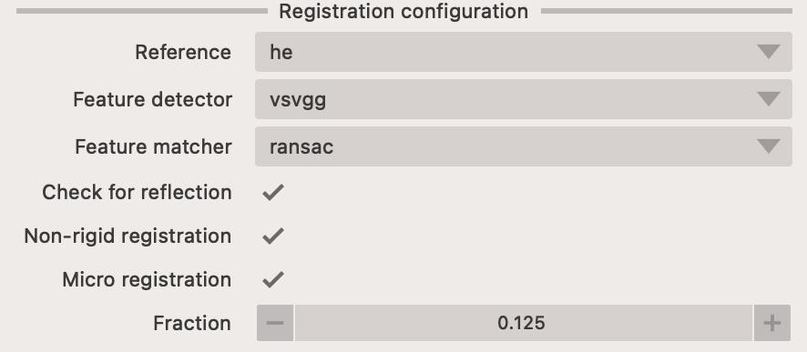
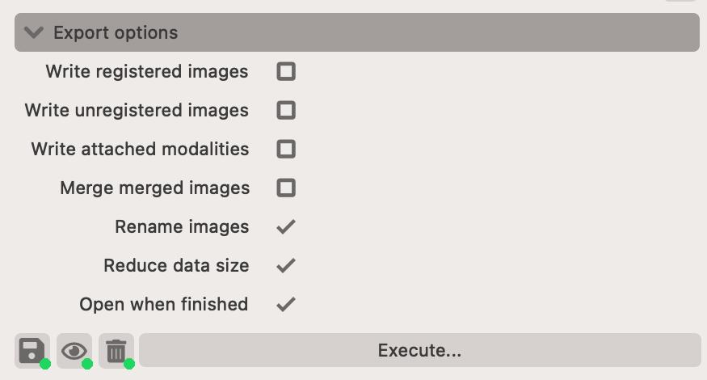
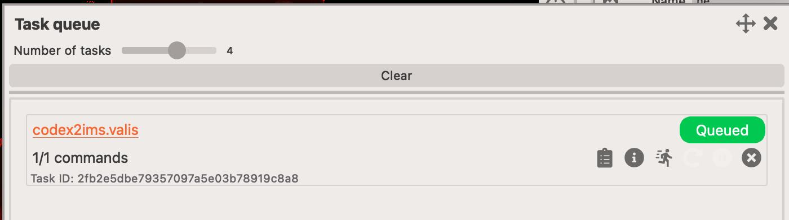

# Valis app

This app performs [Valis](https://www.nature.com/articles/s41467-023-40218-9) registration. It is an excellent whole-slide registration workflow that performs better in non-linear transformations than the [elastix](elastix.md) app.

<figure markdown>
  { width=600px; }
</figure>

## Simplified workflow (see below for more information)

1. Load the images you wish to co-register.
2. Adjust their names, parameters.
3. Establish the registration paths.
4. Adjust the export options.
5. Execute the registration.

## Live preview

You can immediately preview how your images will look like after before registration. This is extremely useful since it's important that images used for registration highlight their features. 

To enable this, make sure to click on the `Use preview image` checkbox.

## Pre-processing

In the top-right corner of the app, you can find the list of image modalities that will be registered. You can adjust the pre-processing parameters for each modality by clicking on the `widget` or on the `Pre-process...` button.

The widget also allows you to adjust the `name` of the modality, spatial resolution (if it was read incorrectly from the file metadata) and the `color` of the image.

There are a number of pre-processing parameters that can be adjusted to improve the registration process.

- Intensity - adjusts how the intensity of the image is transformed.
    - Multi-channel images must be turned into a single-channel image, usually done by using `maximum intensity projection`.
    - You can improve the contrast of the image channels by using `histogram equalization` or `contrast enhancement` (or both).
    - if your image is `light or dark background` (e.g. H&E) then you must `invert` the intensities

# Registration options

Valis works very differently to [elastix](elastix.md) in that it doesn't require you to specify the registration paths. Instead it uses automatically detected fiducial markers between pairs of images to establish the image transformations.

It normally works in three steps:
- low-resolution rigid transformation - this is to roughtly align the images to each other
- low-resolution non-linear transformation - this is to refine the alignment
- high-resolution non-linear transformation - this is to get the final alignment

You can specify a `reference` which will be the image to which all other images are registered to. If reference is left empty (or set to `None`) then then reference is automatically determined based on image similarity.

You can specify the `Feature detector` and `Feature matcher` to be used. These are the algorithms that will be used to detect and match the fiducial markers between images. 
The `gms` feature matcher often fails to work properly, so it's recommended to use `ransac` instead.

You can optioanlly disable the `non-rigid` and `micro` registration. These are the two last steps of the registration process. Disabling them will speed-up the registration process, but might result in a less accurate registration.

The `fraction` parameter controls what fraction of the image will be used for the final registration. If this value is large, it will take much longer, however, it might result in a better registration.

<figure markdown>
  { width=400px; }
</figure>

## Export options

There are several export options available to you. This includes which images (or attachment modalities) should be transformed and exported.

<figure markdown>
  { width=400px; }
</figure>

## Execution

Registration can be executed directly in the app or via the command-line interface. The command-line interface is more powerful, as it permits batch processing, however, the in-app execution is more user-friendly.

<figure markdown>
  { width=400px; }
</figure>

Tasks that are being registered in the app, go the `Tasks queue` widget. You can access it from the statusbar at the bottom of the app.

<figure markdown>
  { width=400px; }
</figure>