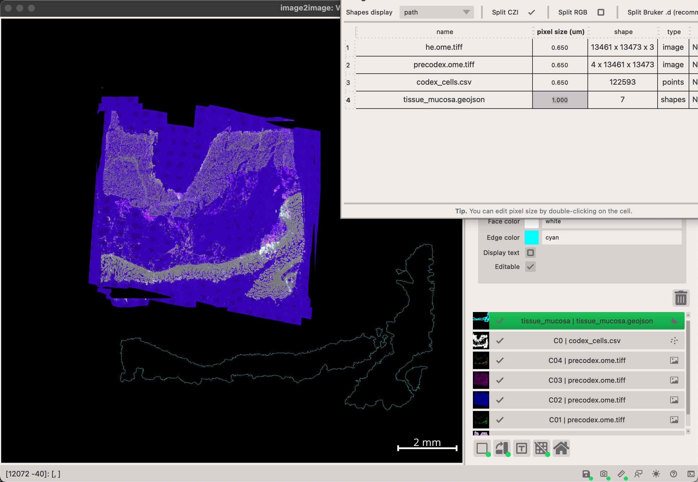

# Viewer app

This app can be used to overlay multiple images together. You can optionally display images with different registration (transformation) information, although, all the images must have ONE common image.

For instance, you have the following images:

* H&E or PAS stain
* preIMS AF
* IMS
* postIMS AF
* CODEX or Xenium data

Normally you would co-register your H&E, preIMS and postIMS AF together but for some reason you didn't, but you still wanted to overlay them. In this case, you would perform manual registration using the [register](register.md) app which produces the `i2r.json` configuration file.

<figure markdown>
  { width=600px; }
  <figcaption>Overlay of H&E, pre-codex AF and nuclear markers detected in CODEX.
</figure>

## Steps to overlay multiple images together

1. Select your images by clicking on the `Add/remove dataset...` button. This opens up a new popup window where you can `Add` and `Remove` images. Make sure to also specify the pixel size/resolution in the table. You can do so by double-clicking ++left-button++ in the field and entering the value. 
2. Select the channels that you want to immediately display. All channels will be loaded BUT not all of them will be displayed immediately. You can show/hide them by using the `layer controls` and clicking on the :material-eye:/:material-eye-off: icon.
3. (optional) If the image you are displaying needs to be `transformed` to a new coordinate system (e.g. IMS to H&E), click on the `Select transformation` button. This opens a new popup window where you can load and select transformations for each image. To add a new transformation from the `i2r.json` file, click on the :material-plus-circle: icon.
4. Adjust the visuals of each of the layers you wish to see in the `Layer controls` section.
5. You can export the information about currently loaded images to a `i2v.json` project file by clickin on the `Export project...` button. These can be re-loaded at later stage by using the `Import project...` button.

## Scale and image resolution

It is essential that the `pixel size` value in the `Datasets` table is correct. Some files, such as `GeoJSONs` are often exported in the `pixel coordinates` (without multiplying by the pixel size of the image, meaning that overlaying them on the image will result in an improper scale if the image has been transformed by applying it's scale). 

It's very easy to adjust the `scale` of any layer by changing the value of the `pixel size` in the table.

<figure markdown>
  { width=600px; }
  <figcaption>Scale is important. Make sure to adjust the `pixel size` of all overlaid datasets or some of them will not look correct.</figcaption>
</figure>

## Dialogs and widgets

### Image selection

Click on the `Add/remove dataset...` button to open the popup window.

<figure markdown>
  { width=600px; }
</figure>

- Double-click ++left-button++ on the value in the `pixel size (um)` to adjust the spatial resolution of the image (and all it's channels).
- Click on the :fontawesome-solid-trash-can: to delete the single image and all it's layers.

### Image transformation

Click on the `Select transformation` button to open the popup window.

<figure markdown>
  { width=600px; }
</figure>

- Click on the :material-plus-circle: to load new transformation information from the `i2r.json` or `i2r.toml` file. Once loaded, the transformation will appear in the combobox to the left of the button.
- Check/uncheck items in the table to select which images should to current transformation be applied to. Click on the `Apply to selected` button to apply it. Changes will be immediately reflected in the image canvas.
- You can always reset the transformation bu applying the `Identity matrix` option.

!!! warning Warning
    If the pixel size/resolution information is incorrect, you might get unexpected results.

### Scalebar

You can easily display scalebar on your image by clicking on the `Tools > Show scale bar controls...` or ++control+s++ on your keyboard.

<figure markdown>
  { width=300px; }
</figure>

- You can change its location (any of the four corners of the image).
- You can change the units (No units, micrometers or pixels.)

!!! note Note
      For the 'micrometers' units to work properly, you must also specify the pixel size in the image table.
