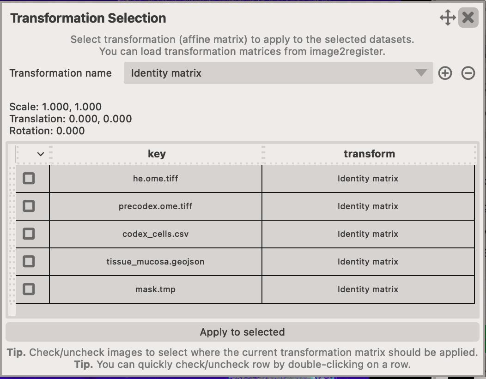

# Viewer app

This app can be used to overlay multiple images together. You can optionally display images with different registration (transformation) information, although, all the images must have ONE common image.

For instance, you have the following images:

* H&E or PAS stain
* preIMS AF
* IMS
* postIMS AF
* CODEX or Xenium data

Normally you would co-register your H&E, preIMS and postIMS AF together but for some reason you didn't, but you still wanted to overlay them. In this case, you would perform manual registration using the [register](register.md) app which produces the `i2r.json` configuration file.

<figure markdown>
  { width=600px; }
  <figcaption>Overlay of H&E, pre-codex AF and nuclear markers detected in CODEX.
</figure>

## Steps to overlay multiple images together

1. Select your images by clicking on the `Add/remove dataset...` button. This opens up a new popup window where you can `Add` and `Remove` images. Make sure to also specify the pixel size/resolution in the table. You can do so by double-clicking ++left-button++ in the field and entering the value. 
2. Select the channels that you want to immediately display. All channels will be loaded BUT not all of them will be displayed immediately. You can show/hide them by using the `layer controls` and clicking on the :material-eye:/:material-eye-off: icon.
3. (optional) If the image you are displaying needs to be `transformed` to a new coordinate system (e.g. IMS to H&E), click on the `Select transformation` button. This opens a new popup window where you can load and select transformations for each image. To add a new transformation from the `i2r.json` file, click on the :material-plus-circle: icon.
4. Adjust the visuals of each of the layers you wish to see in the `Layer controls` section.
5. You can export the information about currently loaded images to a `i2v.json` project file by clickin on the `Export project...` button. These can be re-loaded at later stage by using the `Import project...` button.

## Scale and image resolution

It is essential that the `pixel size` value in the `Datasets` table is correct. Some files, such as `GeoJSONs` are often exported in the `pixel coordinates` (without multiplying by the pixel size of the image, meaning that overlaying them on the image will result in an improper scale if the image has been transformed by applying it's scale). 

It's very easy to adjust the `scale` of any layer by changing the value of the `pixel size` in the table.

<figure markdown>
  { width=600px; }
  <figcaption>Scale is important. Make sure to adjust the `pixel size` of all overlaid datasets or some of them will not look correct.</figcaption>
</figure>

When you load data from `GeoJSON` or text files, you will be prompted to specify the pixel spacing so that the data is properly scaled to match the image.
While its widely accepted that `GeoJSON` files should be exported in the `pixel coordinates`, some software export them in `micrometer` coordinates, so make sure to check which one is the case for your data.

<figure markdown>
  { width=600px; }
  <figcaption>When loading data from GeoJSON or text files, you will be asked to specify the pixel spacing.</figcaption>
</figure>

<figure markdown>
  { width=600px; }
  <figcaption>Scale is important. Once the scale has been set, the images and masks should overlay correctly.</figcaption>
</figure>

## Dialogs and widgets

### Image selection

Click on the `Select channels...` button to open the popup window.
The window shows a unified way of selecting which datasets and channels should be displayed, how the images (or other modalities) should be transform to the common coordinate system.

<figure markdown>
  { width=600px; }
</figure>

- Click on the :fontawesome-solid-trash: to delete the entire dataset (all channels).
- Click on the :octicons-diamond-24: to select the transformation that should be applied to the dataset.
- Click on the :material-view-carousel-outline: to open a new popup window where you can select which channels should be displayed.

### Image transformation

As implied above, you might have images that need to be transformed to a common coordinate system. Often, when we work with multiple imaging modalities, we don't export all images to the 
same coordinate system. For instance, you might have a histology image (H&E or PAS stain), and an IMS image which is often of much lower resolution and much smaller in size.
In such cases, we would manually (or otherwise) register the images together and save the transformation information the `i2r.json` or `i2r.toml` file using the [register](register.md) app.

Then, when you want to display those different images together in the [viewer](viewer.md) app, you would need to apply the transformation to the images that are not in the common coordinate system.

<figure markdown>
  { width=600px; }
</figure>

Here are the steps to apply a transformation to an image:

1. Click on the `Select channels...` button to open the popup window.
2. Click on the :octicons-diamond-24: to open the transformation menu popup.
3. If you've not `dragged-and-dropped` the `i2r.json` or `i2r.toml` file yet, you can do so or click on the `Add` option in the menu to load it.
4. Select the transformation from the list of available options. 
5. The underlying layers (images or otherwise) will be immediately transformed to the new coordinate system.

<figure markdown>
  { width=600px; } 
  <figcaption>Before the IMS data is transformed, it looks like the image on the left-hand side, but after transformation, it is displayed correctly on the H&E image.</figcaption>
</figure>

!!! warning Warning
    If the pixel size/resolution information is incorrect, you might get unexpected results.

### Scalebar

You can easily display scalebar on your image by clicking on the `Tools > Show scale bar controls...` or ++control+s++ on your keyboard.

<figure markdown>
  { width=300px; }
</figure>

- You can change its location (any of the four corners of the image).
- You can change the units (No units, micrometers or pixels.)

!!! note Note
      For the 'micrometers' units to work properly, you must also specify the pixel size in the image table.
