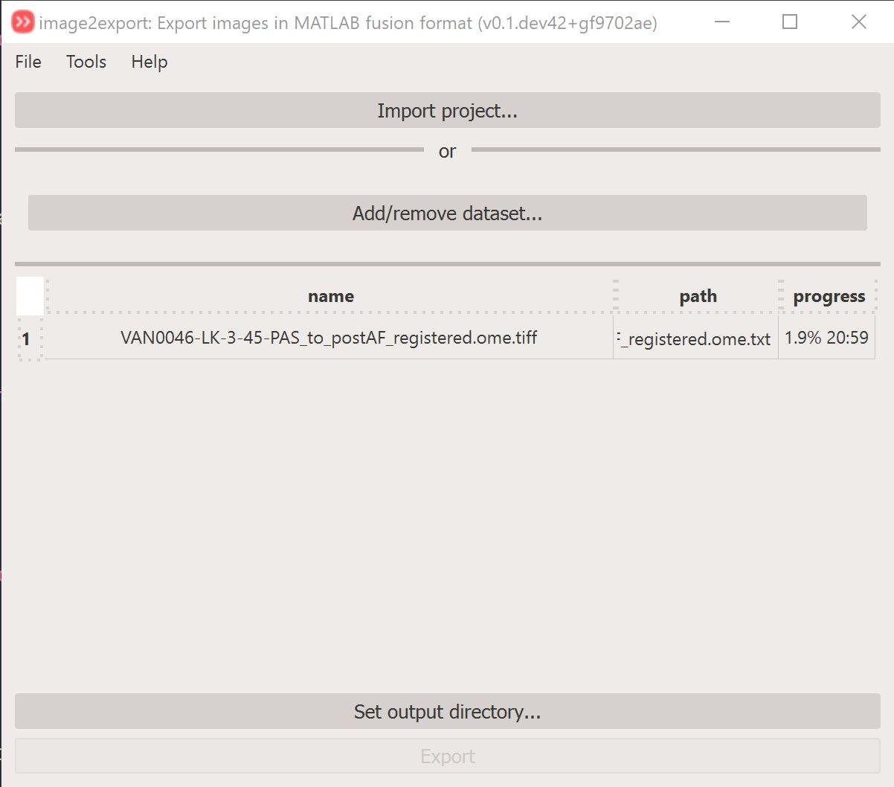

# image2export

!!! warning "This app is not complete"
        This app still have some missing functionality and might not work as intended.

This app enables export of microscopy data in CSV file format that is compatible with Raf Van de Plas' fusion program. The fusion tool uses a non-standard CSV format which can be troublesome to generate using normal tools.

## Steps to export image(s)

1. Select your image by clicking on the `Add/remove dataset...` button. This opens up a new popup window where you can `Add` and `Remove` images.
2. Select the output directory by clicking on the `Set output directory` button.
3. Click on the `Export` button to initiate the output. Progress of the exprt is shown in the `progress` column.

<figure markdown>
  { width=600px; }
</figure>

!!! warning Warning
        This app does not have viewer canvas so the images will **not** be displayed!

## Dialogs and widgets

### Image selection

Click on the `Add/remove dataset...` button to open the popup window.

<figure markdown>
  
</figure>

- Click on `Add image` button to add new image to the list.
- Click on the `Remove image` to remove one or more image from the list.
- Click on the :fontawesome-solid-trash-can: to delete the single image and all it's layers.