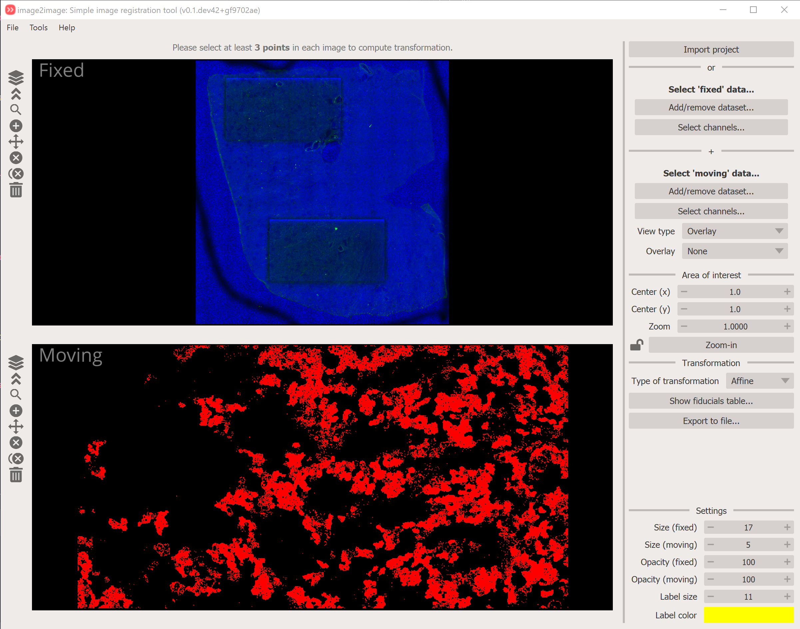
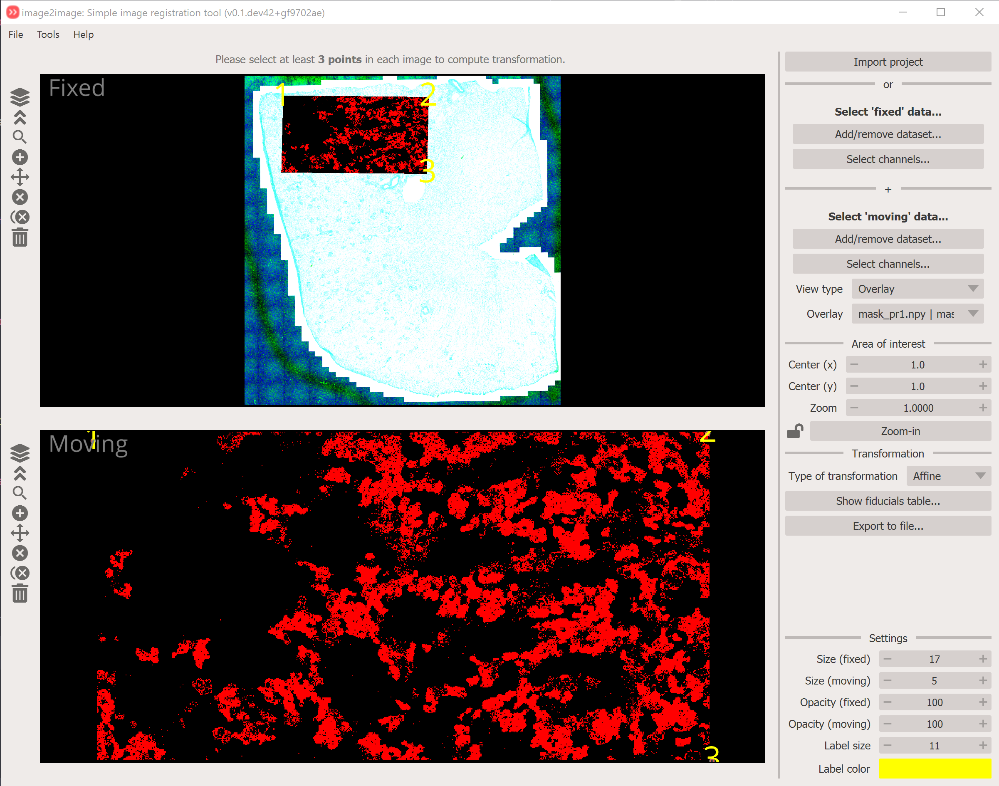
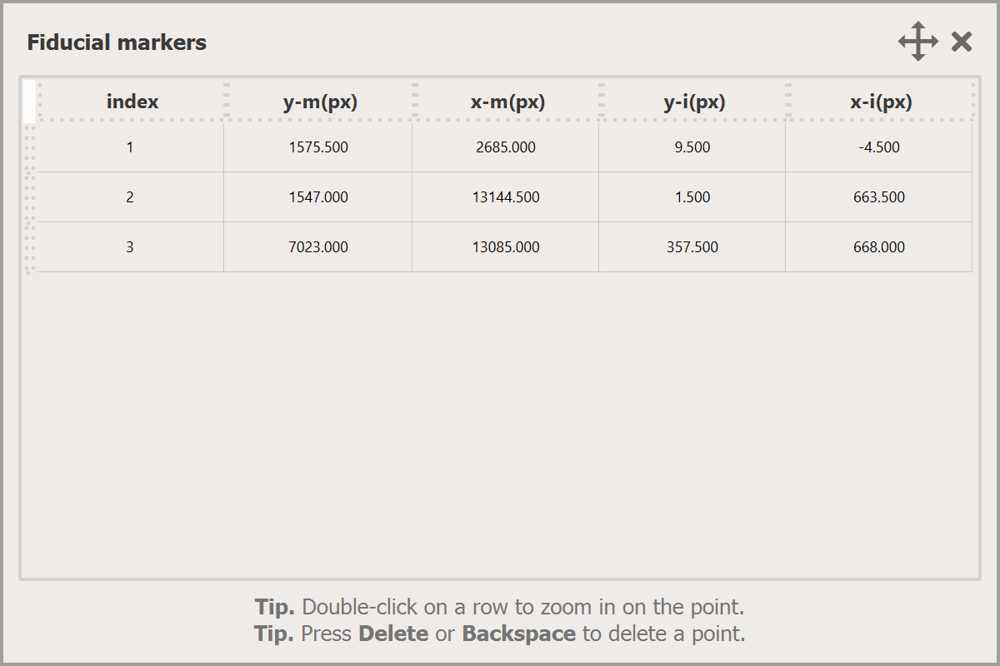

# image2register

This is a simple image registration tool that can be used instead of napari-imsmicrolink.

You should use the napari-wsireg app for automatically registering your microscopy images together, but you can use
image2registration to co-register your IMS data with the postIMS-AF.

This app defines the `Fixed` and `Moving` modalities. As the names suggest, the `Fixed` modality should normally represent the microscopy modality to which you want to co-register your IMS data. Consequently, the `Moving` modality is the IMS dataset.

<figure markdown>
  { width=600px; align=middle }
  <figcaption>Registration app</figcaption>
</figure>

## Steps to get transformation information

1. Select your `Fixed` modality by clicking on the `Add/remove dataset...`.
2. Select the channels you want to immediately display. All channels will be loaded but not all displayed if you've unselected some.
3. Repeat this for the `Moving` modality.
4. Click on the `+` icon in the toolbar on the left-hand side (or click `2` on your keyboard to activate the `add` mode).
5. Select at least 3 points in each image to estimate transformation matrix. After that, you can click in either image and the other will be predicted.
6. Once you are happy with your results. Save them as the `i2r.json` format.

<figure markdown>
  { width=600px; align=middle }
  <figcaption>Registration app after putting in a couple of fiducials</figcaption>
</figure>

## You can review the fiducials in the `fiducials table`

You access the table, simply click on the `Show fiducials table...` which launches a pop-up window like this:

<figure markdown>
  { width=600px; align=middle }
  <figcaption>Fiducials table</figcaption>
</figure>

This table shows each pair of points from the `fixed` and `moving` modalities.