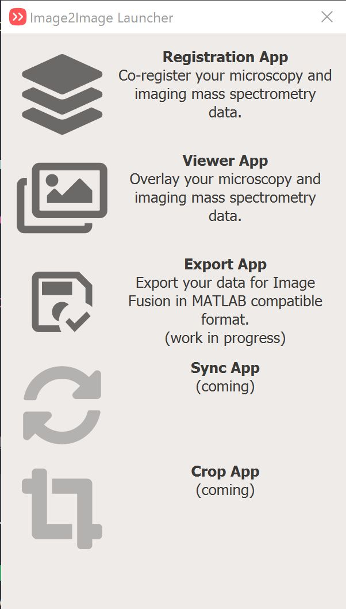

# Welcome

image2image is a GUI application consisting of several small(ish) apps that perform actions such as visualization, registration, channel merging, and much more.

To launch any of the apps you use the 'launcher' app.

<figure markdown>
  { width=600px; align=middle }
</figure>

Applicatiosn can be split between three main themes:

## Visualisation apps

### [Viewer app](apps/viewer.md)

This app let's you visualise multiple iamging datasets (e.g. IMS, microscopy, CODEX, Xenium, masks, etc) in one viewer.
It let's you load multiple datasets together, apply different transformations to each dataset (e.g. loading positive and negative mode IMS data simultaneously).

## Registration apps

### [Registration app](apps/register.md)

This app let's you establish the affine transformation between a pair of images using fiducial markers. 
This can be useful in co-registering imaging mass spectrometry (IMS) data with microscopy data.

### [Elastix app](apps/elastix.md)

This app enables registration of whole slide images (WSI) using the `Elastix` library.

### [Valis app](apps/valis.md)

This app enables registration of whole slide images (WSI) using the `Valis` library. 

## Utility apps

### [Crop app](apps/crop.md)

This app let's you crop microscopy images using polygons or rectangles and export them in OME-TIFF format.

### [Convert app](apps/convert.md)

This app enables conversion of many microscopy formats into an OME-TIFF. This is useful for compatibility with other software.

### [Merge app](apps/merge.md)

This app enables merging of multiple channels (or multiple files) into a single OME-TIFF file. This is useful for compatibility with other software.

### [Fusion app](apps/fusion.md)

This app enables export of microscopy data in a format that is compatible with Raf Van de Plas' MATLAB fusion app.

## Some other apps that will be added in the future

### [Sync app](apps/na.md) (coming)

This app will provide interface similar to image2viewer but will have two side-by-side canvases for synchronized viewing. Very helpful when trying to show masks or compare spatial patterns in different modalities.