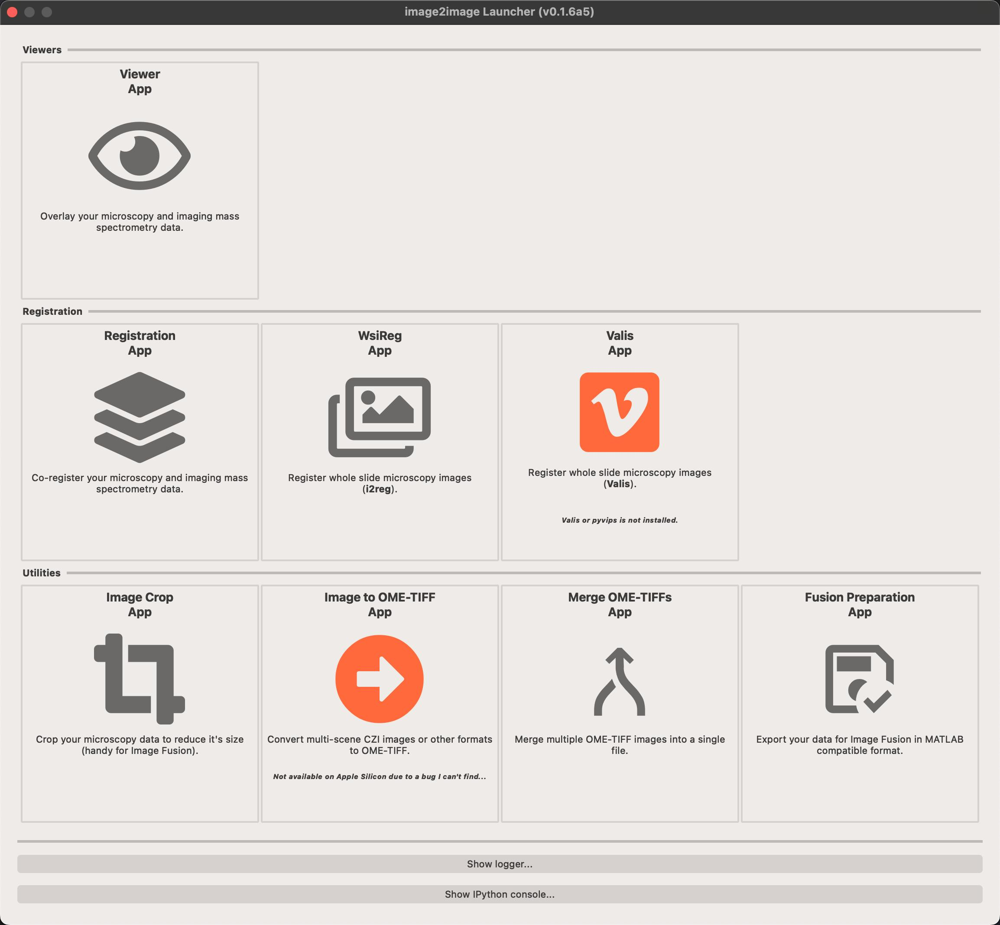

# Welcome

image2image is a GUI application consisting of several smaller programs that perform a specific task.

To launch any of the apps you use the 'launcher' app.

<figure markdown>
  { width=300px; align=middle }
</figure>

## Available apps

### [image2register](image2register.md)

This app will let you register your imaging mass spectrometry (or any other imaging) dataset with another image (e.g. postIMS AF). 

### [image2viewer](image2viewer.md)

This app let's you visualise and overlay multiple imaging datasets (IMS, microscopy, CODEX, etc) in one viewer, even if each of those has different transformation information.

### [image2export](image2export.md) (work in progress)

This app enables export of microscopy data in a format that is compatible with Raf Van de Plas' MATLAB fusion app.

## Some other apps that will be added in the future

### [image2sync](image2sync.md) (coming)

This app will provide interface similar to image2viewer but will have two side-by-side canvases for synchronized viewing. Very helpful when trying to show masks or compare spatial patterns in different modalities.

### [image2crop](image2crop.md) (coming)

This app will let's you draw rectangles and crop microscopy data and export in ome.tiff format. This should be helpful for Raf Van de Plas' MATLAB fusion app.